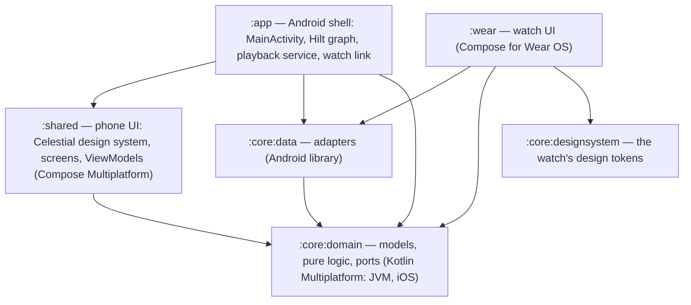

# Architecture

Clean architecture with ports and adapters. Dependencies point inward only:
`:app` / `:wear` → `:core:data` → `:core:domain`, and `:app` → `:shared` → `:core:domain`. The
phone's UI lives in `:shared` (Compose Multiplatform, Android + iOS); `:app` is the Android shell
that hosts it and provides the adapters. The Konsist rules in `:architecture-test` enforce the
boundaries.

## Layers

### Domain (`:core:domain`, package `dev.sadakat.qandeel.core.domain`)
Kotlin Multiplatform (sources in `src/commonMain/kotlin/`) — no Android, no androidx, no imports from outer layers
(`DomainIsolationTest` fails the build otherwise).

- `model/` — `QuranMeta` (surah structure, global ayah numbering), `Surah`, `Ayah`, `AyahRef`,
  `Revelation`, `Track`, `RecitationMode`
- `audio/` — `QuranAudioUrls` (file URLs + download ids), `QueuePlan` + `QueueItemId` +
  `QueueEntry` (the play queue), `DownloadAggregation` + `FileDownloadState`
- `repository/` — the ports `QuranText`, `QuranSettings` (+ `LastPosition`), `SurahDownloads`
  (+ `SurahDownloadState` and `stateOf` helpers), `AudioTimings`, `WordMeanings`,
  `ListeningHistory`, `WatchConnection`
- `player/` — the port `QuranPlayer` (+ `NowPlaying`)

### Data (`:core:data`, package `dev.sadakat.qandeel.core.data`)
Android library; one adapter per port:

| Port | Adapter |
| --- | --- |
| `QuranText` | `text/AssetQuranText` (assets parsed by `text/QuranTextParser`) |
| `QuranSettings` | `settings/DataStoreQuranSettings` |
| `SurahDownloads` | `audio/MediaSurahDownloads` (Media3 downloads via `audio/QuranCache`) |
| `QuranPlayer` | `player/ExoQuranPlayer` (the app-wide `ExoPlayer`) |

Plus `audio/QuranDownloadService` (foreground download service), `audio/QuranMediaItems`
(queue → media items) and `link/` (`QuranDownloadMessage`, `WearPaths`).

### Presentation (`..presentation..` in `:shared` and `:wear`)
- Talks to **domain ports only** — importing `dev.sadakat.qandeel.core.data` or Media3 fails
  `PresentationIsolationTest`.
- ViewModels expose one immutable `StateFlow<XxxUiState>` (data class) plus plain functions for
  user actions (unidirectional data flow). In `:shared` they are plain classes that take ports,
  built from `QandeelGraph` with `viewModel { }` factories (`shared/.../app/ViewModels.kt`); in
  `:wear` they are `@HiltViewModel`.
- Stateless screen composables take the UiState + lambdas (in `:shared`, an actions class such
  as `ReaderActions`); `:shared`'s `app/Navigation.kt` and `:wear`'s `XxxRoute` composables
  wire in the ViewModels. Every composable that emits UI takes `modifier: Modifier = Modifier`.
- No `!!`, no `GlobalScope`, no blocking calls on the main thread, no `Context` in ViewModel
  constructors, no public `MutableStateFlow` (all checked by `ViewModelArchitectureTest` /
  `UiStateArchitectureTest`).

## Where business logic lives
Rules that are true regardless of platform — the queue for a surah in a mode, basmala prefix
rules, next/previous-by-ayah, download aggregation, URL layout — are pure objects in the domain
and unit-tested on the JVM. Android specifics (when to start a service, how to observe the
`DownloadManager`, DataStore keys) stay in the adapters.

## Conventions
- Kotlin official style, 4-space indent, 120 cols, no wildcard imports, trailing commas ok
  (Spotless + ktlint, config in `.editorconfig`).
- KDoc on public types; comments explain *why*.
- TDD is mandatory: red → green → refactor (see `docs/QUALITY.md` and the test stacks in
  `data-flow.md` / `build-config.md`).

## Detailed docs
`docs/ARCHITECTURE.md` covers the queue model, downloads, playback wiring, the phone UI in
`:shared`, the Celestial design system and the phone→watch message in depth.
