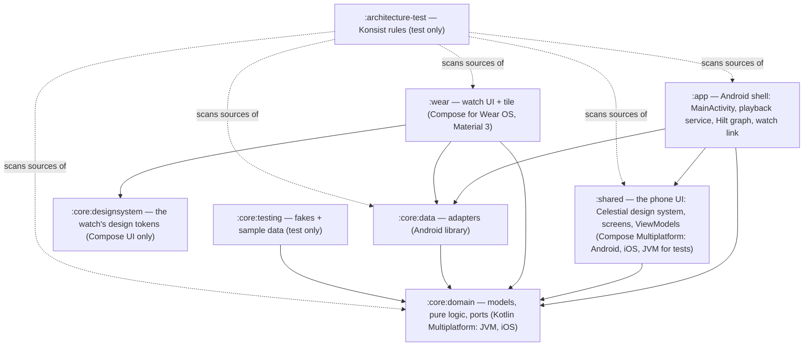

# Architecture

Qandeel is a Quran player for phone and Wear OS, built as clean architecture with ports and adapters.
The domain is a pure Kotlin island; everything Android (ExoPlayer, DataStore, assets, the Wearable
data layer) lives in adapters behind interfaces. The phone's UI is written once, for Android and
iOS, in `:shared` (Compose Multiplatform); `:app` is the Android shell that hosts it. The watch
(`:wear`) has its own UI. Both sit on the same core.

## Modules

Dependency rule: **inward only**. `:core:domain` imports nothing from Android or the outer layers
(enforced by `DomainIsolationTest`); presentation code (`..presentation..`, in `:shared` and
`:wear`) imports domain ports only, never `dev.sadakat.qandeel.core.data` or Media3 (enforced by
`PresentationIsolationTest`). Both tests are Konsist rules in `:architecture-test`. `:shared`
depends on `:core:domain` alone, so it compiles for iOS; `:app` hands it the Android adapters
through `QandeelGraph` (see [The phone UI](#the-phone-ui-shared)). `:core:designsystem` depends on
nothing of ours and on no Material library (`DesignSystemArchitectureTest`).

## The domain (`:core:domain`)

**Fixed structure of the Quran** — `model/QuranMeta.kt` knows the 114 surah lengths and converts
between per-surah ayah numbers and the global ayah numbering (1..6236) every audio source uses. It
also answers `hasBasmalaPrefix` (true for every surah except Al-Fatiha and At-Tawbah) and knows
where each of the 30 juz starts (`juzStart`, `juzOf`).

**Models** (`model/`):

- `Surah` — number, Arabic/transliterated/English names, ayah count, `Revelation` (Meccan/Medinan).
- `Ayah` — one verse with Arabic (Uthmani), English (Saheeh International) and Bangla (Muhiuddin
  Khan) text; `translation(track)` picks the translation of a track.
- `AyahRef` — a position (`surah`, `ayah`); ayah 0 is the basmala before verse 1.
- `Track` — one recording: `ARABIC`/`ENGLISH`/`BANGLA` with stable codes `ar`/`en`/`bn` used in
  media ids, download ids and messages.
- `RecitationMode` — what plays for each ayah, in order: `ARABIC_ONLY`, `ARABIC_ENGLISH` or
  `ARABIC_BANGLA`.
- `ReadingPrefs` — the reading settings: `ArabicTextSize` (a scale factor), show translation,
  follow along, `WordByWord` (the language of each word's meaning, or off), `ThemeMode` and reduce
  motion. The old style (`UiStyle`) and wallpaper-color (`dynamicColor`) fields are still stored,
  but no UI reads them.
- `AyahRefParser` — reads a typed reference ("2:255", "2.255", "২:২৫৫", "٢:٢٥٥") into an `AyahRef`
  when that ayah exists; search uses it to jump.
- `ArabicWords` — an ayah's words as the word pointer moves over them: whitespace tokens, where a
  standalone pause mark (ۖ ۗ ۚ …, ۞, ۩) belongs to its neighbouring word. The bundled word timings
  count words the same way.
- `ListeningProgress` — from the heard counts: per surah (`SurahListening`) its full **rounds**
  (every ayah heard that many times), how far the next round has come, listens and time; for the
  Quran (`QuranListening`) the ayahs heard, rounds and time; and the Progress screen's orders.

**Pure logic** (`audio/`):

- `QuranAudioUrls` — where each verse file lives (see [Audio sources](#audio-and-downloads)) and
  the download id of each file (`"ar/255"`, `"bn/intro/2"`, …).
- `QueuePlan` — builds a surah's play queue and computes next/previous by ayah (see
  [The queue model](#the-queue-model)).
- `DownloadAggregation` — derives per-surah download state from per-file state (see
  [Downloads](#audio-and-downloads)), and a running batch's whole progress (`batchProgress`).
- `WordTimings` — when each word of an ayah is recited in its file; `wordAt(positionMs)`.
- `SurahTimeline` — a queue laid end to end from its files' lengths: an item position is a surah
  position (`positionOf`) and back (`locate`).

**Playback options** (`player/`): `PlaybackSpeed` (0.75×–1.5×), `RepeatSetting` (`Off`, `Ayah(times)`
— every ayah N times, or the current one forever — and `Range(from, to, times)`), `SleepOption`
(minutes or end of surah) and `SleepTimerStatus`. Their rules are pure:

- `RepeatPolicy` — what happens when an ayah ends (`Advance`, `JumpTo(ayah)`, `Finish` after a
  counted range's last round), how a manual move affects a repeat (an ayah repeat restarts its
  count; a range survives moves inside it and is dropped once playback leaves it), and where
  playback jumps when a range is chosen elsewhere. The basmala never repeats.
- `SleepTimer` — status, fade volume and "is due" from explicit timestamps: the last 20 s fade out
  on an equal-power curve, and the end-of-surah stop fades over the last seconds of recitation in
  wall time (media time divided by the speed).
- `ListenTracker` — which ayahs count as heard: an ayah counts once its **Arabic** item plays to its
  end; skipping it, starting it in the middle or jumping forward inside it doesn't count; each
  play-through counts (so each memorizing repeat does). The basmala never counts.
- `WordPointer` — where the pointer is: `Reciting(word)` while the Arabic plays, `Translating` while
  the translation does, `Off` otherwise; `WordPointer.of(nowPlaying, progress, timings)`.
- `PlaybackProgress` — the position in the current item and in the whole surah, and its length.

**Ports** — interfaces the adapters implement:

| Port | Package | What it gives |
| --- | --- | --- |
| `QuranText` | `repository/` | All surahs and every surah's ayahs (offline, from assets) |
| `QuranSettings` | `repository/` | `Flow<RecitationMode>`, `Flow<BanglaVoice>`, `Flow<LastPosition?>`, `Flow<ReadingPrefs>`, `Flow<PlaybackSpeed>` and `Flow<Boolean>` onboarding done (an update from a version without onboarding counts as done), persisted |
| `SurahDownloads` | `repository/` | `StateFlow<Map<Int, Map<Track, SurahDownloadState>>>` (surah number → track → state), `download(surah, tracks)`, `remove(surah, tracks)` |
| `QuranPlayer` | `player/` | `StateFlow<NowPlaying?>` (with speed and repeat), `StateFlow<String?>` error, `StateFlow<SleepTimerStatus>`, `Flow<PlaybackProgress>` (ticks while playing) and `Flow<WordPointer>` (once per word); `play`, `togglePlayPause`, `nextAyah`, `previousAyah`, `seekTo(surahPositionMs)`, `stop`, `restoreLast`, `setRepeat`, `setSpeed`, `setSleepTimer` |
| `AudioTimings` | `repository/` | Each surah's `WordTimings` by ayah (ayah 0 = the basmala, recited from 1:1's file) and every audio file's length |
| `WordMeanings` | `repository/` | Each surah's word meanings by ayah in English or Bangla, one per `ArabicWords` word (ayah 0 = the basmala, 1:1's) |
| `ListeningHistory` | `repository/` | `Flow<ListeningCounts>` (heard counts per ayah, last heard and time per surah, over all devices), `recordHeard`, `addListeningTime`, `localSnapshot`/`importSnapshot` (device sync) and `reset` |
| `WatchConnection` | `repository/` | `isWatchReachable`, `sendDownload(surah, tracks)` to every reachable watch (an iPhone has none) |

## The adapters (`:core:data`)

| Port | Adapter | How |
| --- | --- | --- |
| `QuranText` | `text/AssetQuranText` | Reads `assets/quran/surahs.json` and `assets/quran/text/001..114.json` (generated by `scripts/build_quran_text.py`), parsed by `QuranTextParser`; keeps the 6 most recently used surahs in memory |
| `QuranSettings` | `settings/DataStoreQuranSettings` | Preferences DataStore `quran_settings` |
| `SurahDownloads` | `audio/MediaSurahDownloads` | Media3 `DownloadManager` from `QuranCache`, one download per verse file |
| `QuranPlayer` | `player/ExoQuranPlayer` | The app-wide `ExoPlayer` |
| `AudioTimings` | `audio/AssetAudioTimings` | Reads `assets/quran/timing/ar.alafasy/001..114.json` and `assets/quran/audio/durations.json` (generated by `scripts/build_audio_timing.py`), parsed by `AudioTimingParser`; keeps a few surahs' timings in memory |
| `WordMeanings` | `text/AssetWordMeanings` | Reads `assets/quran/words/{en,bn}/001..114.json` (generated by `scripts/build_word_meanings.py` from Quran.com), parsed by `WordMeaningsParser`; keeps a few surahs' meanings in memory. The watch APK leaves these assets out |
| `ListeningHistory` | `listening/RoomListeningHistory` | Room `QuranDatabase` (`quran.db`, version 1, schema exported to `core/data/schemas/`): `ayah_listens` and `surah_listening` rows per **source** (`local`, or `watch:<node>` for what a watch sent), summed for the counts; a reset clears every source and remembers when, so a snapshot counted before it is ignored |

Supporting pieces: `audio/QuranCache` (the shared cache + download manager), `audio/QuranDownloadService`
(foreground service for downloads, with `DownloadNotifications` and `SurahFinishes`),
`audio/QuranMediaItems` (queue → media items), `player/ListeningRecorder` (writes what is heard),
`link/QuranDownloadMessage`, `link/ListeningMessages` + `link/WearPaths` (phone ↔ watch).

## The queue model

`QueuePlan.plan(surah, mode)` builds the queue as a flat list of `QueueEntry`s:

1. **Basmala prefix** (ayah 0), only for surahs with one (`QuranMeta.hasBasmalaPrefix`):
   - Arabic only → the Arabic basmala,
   - Arabic + English → Arabic basmala, then the English one,
   - Arabic + Bangla → only the Bangla intro (`bn/intro/{surah}`) — it already contains the Arabic
     basmala followed by its translation, so no separate Arabic prefix.
2. **Verses** — for each ayah 1..ayahCount, one entry per track of the mode, in the mode's order.

Each entry's identity is a `QueueItemId` (`surah`, `ayah`, `track`); its media id is
`"{surah}:{ayah}:{trackCode}"`, e.g. `2:255:ar`. `QueueItemId.parse` is the inverse, returning null
for anything that is not a Quran queue item.

Navigation is **by ayah, not by item**: because ayah numbers grow monotonically along the queue,
`nextAyahIndex` finds the first item beyond the current ayah's, and `previousAyahIndex` restarts the
current ayah when the player is past its first item or more than 3 s into it, else jumps to the
previous ayah's first item. The same rules apply to the media notification's next/previous buttons
(see below).

## Audio and downloads

Three verse-by-verse recordings, addressed by global ayah number (`QuranAudioUrls`):

| Track | Source |
| --- | --- |
| Arabic (Alafasy, 128k) | `https://cdn.islamic.network/quran/audio/128/ar.alafasy/{global}.mp3` |
| English (Walk, 192k) | `https://cdn.islamic.network/quran/audio/192/en.walk/{global}.mp3` |
| Bangla | `https://huggingface.co/datasets/faddy001/quran_audio/resolve/main/bangla/bangla-translation-verses/{NNNNN}.mp3` |

Arabic and English reuse verse 1 of the Quran (which *is* the basmala) as their basmala; Bangla uses
a per-surah intro file. `QuranAudioUrls.surahFiles(surah, track)` lists every file a surah/track
pair needs — basmala (if any) plus all verses.

**One Media3 download per verse file.** `MediaSurahDownloads.download(surah, tracks)` enqueues a
`DownloadRequest` per file into `QuranCache`'s `DownloadManager` (max 4 parallel downloads, requires
a network), skipping files already completed, and starts `QuranDownloadService` so downloads survive
the app going away. Downloaded files land in `QuranCache`'s `SimpleCache`
(`<filesDir>/quran_audio`, never evicted — files leave only through `remove`).

**Aggregation** (`DownloadAggregation`): the state of a surah/track pair is derived from the states
of its files, keyed by download id. Download ids are globally unique per verse file — except the
shared basmala `"ar/1"`/`"en/1"`, which every surah's file list contains (and which doubles as
Al-Fatiha's first verse). The aggregator therefore only counts *own* files — ids that belong to this
pair alone — when deciding whether a pair is tracked at all, so downloading Al-Baqarah never makes
Al-Fatiha look half-downloaded. A pair is `Downloaded` when all files are completed, `Downloading`
while any file is active, `Failed` when some failed for good (downloading again retries).
`remove` deletes a pair's files, but keeps a shared basmala alive while any other tracked pair still
needs it. The combined `stateOf(surah, tracks)` helpers roll several tracks (e.g. a mode's) into
one state for the UI.

**The notification.** Media3's own progress notification averages only the few files in flight, so
with one download per ayah its bar kept filling and restarting. `QuranDownloadService` builds its
own (`DownloadNotifications`) from `DownloadAggregation.batchProgress` over the queued and running
files: every surah/track pair with an own file in flight counts with all its files, so the bar is
the whole batch's ("Downloading Al-Kahf · 64%", "Downloading 3 surahs") and only ever rises. It says
when it waits for a network, and `SurahFinishes` posts one notification per surah that finishes —
ready offline, or some files failed — but not for a surah whose download was cancelled.

## Playback wiring

Both apps use **one app-wide `ExoPlayer`** (provided by each app's `di/MediaModule.kt`), with a
`CacheDataSource` from `QuranCache`: downloaded files are read from the cache (works offline), and
anything else streams over the network — the data source is **read-only for streaming**
(`setCacheWriteDataSinkFactory(null)`), so streaming never masquerades as a download.

`ExoQuranPlayer` implements `QuranPlayer` on that player:

- `play(surah, fromAyah, mode)` builds the media items (`QuranMediaItems`: uri = the file's URL,
  which is also the cache key; media id = the queue item id; metadata for the notification, e.g.
  title "Al-Baqara 2:255"), seeks to the first item of `fromAyah`, prepares, plays, and starts the
  app's `MediaSessionService` (resolved through its `androidx.media3.session.MediaSessionService`
  intent filter) so playback survives the background.
- Player listener events are folded into `nowPlaying: StateFlow<NowPlaying?>` (surah, ayah, track,
  mode, isPlaying, isBuffering) and `error: StateFlow<String?>` (network failures get a
  "check your connection or download this surah" message; the error clears when playback resumes).
- The position is persisted via `QuranSettings.saveLastPosition` whenever the **ayah** changes
  (moving between tracks of the same ayah does not rewrite it).
- `restoreLast` re-queues the saved position, paused, so the player bar reappears after an app
  restart.

**Repeat, speed and the sleep timer.** A repeat acts at ayah boundaries: when the current item is
the last item of an ayah where `RepeatPolicy` intervenes, the player sets
`pauseAtEndOfMediaItems`, so ExoPlayer pauses exactly at the item's end; the listener then applies
the policy's step (jump back and play, carry on, or stop) — the next ayah never blips in, and with
a translation the repeat waits for it. `NowPlaying.isPlaying` stays true across that hop. Speed is
`setPlaybackSpeed` (pitch kept), persisted, and re-applied on `play`/`restoreLast`. The sleep timer
ticks `SleepTimer` on a monotonic clock (every second, ten times a second while fading), sets the
player's volume, pauses when due and restores the volume; the end-of-surah stop wins over a range
that loops the last ayah.

**The surah as one timeline.** Each ayah (and its translation) is a file of its own, but the
bundled file lengths (`AudioTimings.durationMs`) lay the queue end to end (`SurahTimeline`, built
with the queue): `progress` reports the position in the item (for the word pointer) and in the
surah (for the time bars), and `seekTo(surahPositionMs)` locates the item and moves there with the
same repeat bookkeeping as a manual move. `pointer` combines `nowPlaying`, `progress` and the
surah's word timings into `WordPointer`, distinct per word. Without the lengths (never, with the
bundled table) everything falls back to the current file.

**What is heard.** `ListeningRecorder` is a listener of its own on the player, so it sees events in
the order they happened (when a repeat jumps back at an ayah's end, the end is reported first). It
feeds `ListenTracker` from position discontinuities (an auto transition finishes the old item;
seeks within an item skip or re-arm it), the boundary pause and `STATE_ENDED`, and writes each
counted ayah to `ListeningHistory` with the wall-clock time; the time spent playing is added per
surah on every pause and item change.

**MediaSession.** The session wraps not the raw player but `ExoQuranPlayer.sessionPlayer` — an
ayah-aware `ForwardingPlayer` whose `seekToNext`/`seekToPrevious` (and their media-item variants)
delegate to `nextAyah()`/`previousAyah()`. So the notification's skip buttons move by ayah, not by
track. Its duration, positions and `seekTo(positionMs)` are the whole surah's (Media3's platform
session reads them through `PlayerWrapper`), so the system seek bar runs through the surah
instead of restarting with every file, and dragging it moves across ayahs. It also hides Media3's repeat and shuffle from system controls: Media3's repeat would loop a
single track (only the Arabic, or only the translation), and shuffle means nothing for a surah. The phone's `service/QuranPlaybackService` (`MediaSessionService`) injects the singleton
`MediaSession` built in `di/MediaModule.kt`; the watch's `service/QuranPlaybackService` builds the
same kind of session over its own player instance.

## The phone UI (`:shared`)

`:shared` is Kotlin Multiplatform with Compose Multiplatform, package `dev.sadakat.qandeel.shared`.
Its targets are `android`, `jvm` (tests only) and `iosArm64`/`iosSimulatorArm64` (the framework
`Shared`). It uses Compose foundation and no Material library: every control comes from the
Celestial kit (below). Code that talks to Skia directly lives once in `skikoMain` (iOS and the JVM).

**Wiring** (`app/`):

- `QandeelGraph` — the domain ports the ViewModels are built from (`QuranText`, `QuranSettings`,
  `SurahDownloads`, `QuranPlayer`, `ListeningHistory`, `AudioTimings`, `WordMeanings`,
  `WatchConnection`) and the clock. On Android a Hilt `@Singleton` implements it
  (`AndroidQandeelGraph` in `:app`); on iOS a Kotlin object will. No DI library crosses platforms.
- `QandeelPlatform` — what only the platform can do: the version name, the share sheet, asking to
  show notifications. `MainActivity` implements it.
- `ViewModels.kt` — each ViewModel built from the graph with a `viewModel { }` factory, scoped to
  the destination that asks for it. The ViewModels are plain classes that take ports.
- `QandeelApp` — the root. Until the settings are read nothing is drawn, so the first frame has
  the right sky. A new install gets onboarding (`QuranSettings.onboardingDone`); after it, the
  `CelestialTheme` the settings choose (night or dawn, reduce motion, the Arabic size) around a
  `NavHost` (navigation-compose for Compose Multiplatform). Routes are `@Serializable`
  (`Routes.kt`: `TabsRoute`, `ReaderRoute(surah, ayah)`, `PlayerRoute`, `ProgressRoute`,
  `AboutRoute`), and `Navigation.kt` binds each to its ViewModels and actions. One
  `PlayerViewModel` serves the mini player, the full player and the playback-error toast;
  `MiniPlayerMapping` turns its state into the mini player, or nothing when nothing is queued.

**Screens** (`presentation/`). Each is a stateless composable over its `UiState` and an actions
class (`HomeTabActions`, `ReaderActions`, `PlayerActions`, …):

- `onboarding/` — five pages over the live sky: welcome, listening (mode and Bangla voice, with a
  sample), reading, look and motion, offline and watch. Finishing saves every choice and starts the
  starter downloads; skip keeps the defaults. Updates from a version without onboarding skip it.
- `main/MainTabs` — the frame: the selected tab (Home, Quran, You), and floating over it the mini
  player (`MiniPlayerBar`, while something is queued) and the tab bar. Each tab draws its own sky
  and gets the floating chrome's height as content padding.
- `home/` — `HomeTab`: the lamp over the wordmark, the continue card, the surahs heard lately and a
  glance at the whole Quran's progress. `QuranTab`: one search for names, numbers and verse
  references (`SurahSearch`; "2:255" offers to go straight there), then every surah, the 30 juz, or
  the surahs on the phone. Both read `HomeViewModel`.
- `you/` — `YouTab`: a progress card, then the settings grouped as listening (mode, Bangla voice),
  reading (size, translation, follow along, word by word) and appearance (Theme: Auto, Light or
  Dark; Reduce motion), then About. `SettingsViewModel` applies each change at once; a change to
  what plays re-queues the recitation at the same ayah.
- `progress/` (`ProgressScreen`, `ProgressViewModel`) and `about/` open over the tabs.
- `reader/` — `ReaderScreen` and `SurahReaderViewModel`. Reading, it is a column of ayahs on the
  sky, each with its meaning; tap one to play from it, long-press for `AyahActionsSheet` (play from
  it, repeat it, copy or share it with `AyahShareText`, and its words with their meanings). While
  its surah plays the reader turns to **lyrics mode**: the reciting ayah glides onto a line in the
  upper third, lit, with the gold word pointer, and the others fade back (`FollowAlong`: a drag
  pauses following, a chip jumps back). The header's offline button downloads, retries or removes
  the surah (removing asks first); the "Aa" sheet sets size, translation and word by word; the
  overflow sends the surah to the watch. With word by word on, tapping a word plays from it.
- `player/` — `PlayerScreen`, full-screen and centred on the ayah: the Arabic large with the word
  pointer, the meaning of the word being recited, and the translation; behind them the lantern as a
  soft glow that swells with each recited word. Below: `TimeBar` (the whole surah; drag or tap to
  move, and it names the ayah under the thumb), the transport, and pills for the recitation,
  repeat, speed and sleep that open their sheets (`PlayerSheets`). `PlayerViewModel` restores the
  last position, paused, so the mini player is back after a restart.
- `components/` — `RecitedArabicText` draws the word pointer (the recited word on a pill drawn
  behind the text, other words by colour, so the text never reflows) and keeps the recited line in
  view in long ayahs; `WordByWordText` lays an ayah out word by word, each word over its meaning,
  right to left. Also `SurahRow`, `ScreenHeader` and `CenteredMessage`.

**Resources.** Strings live in `composeResources/values/strings*.xml` and are read as `Res.string`
(package `dev.sadakat.qandeel.shared.resources`); the fonts (Amiri Quran, Fraunces, Manrope) in
`composeResources/font/`.

`:app` is the shell around it: `MainActivity` hosts `QandeelApp` and paints the window with the
sky's top colour before the first frame; the playback service, the Hilt graph and the watch link
stay Android code.

## The Celestial design system (`:shared`, `designsystem/`)

One look, no styles to choose: a night sky (indigo to deep green, lit by mushaf gold) or the same
sky at dawn (pale gold over warm paper).

- **Tokens.** `CelestialColors` (`CelestialPalette.night` and `.dawn`: the sky's `SkyColors`, glass
  and its edge, ink, the gold accent), `CelestialType` (Fraunces for names and titles, Manrope for
  UI), `QuranType` (Amiri Quran with tall lines for the stacked marks; RTL text direction, so
  align Arabic right or centre, not "end"), and `CelestialSpacing` and `CelestialShapes`
  (`CelestialScale.kt`). `CelestialTheme(night, reduceMotion, arabicScale)` provides them, read as
  `Celestial.colors`, `.type`, `.quran`, `.spacing`, `.shapes` and `.reduceMotion`.
- **Motion.** `Celestial.clock` (`CelestialClock`) gives the seconds since the sky started. It is
  read only while drawing, so motion redraws without recomposing. Reduce motion stops it; tests set
  it to draw any moment.
- **The sky** (`effects/`). `CelestialSky` is one fragment shader (`SkyShader`): a gradient, a slow
  nebula, the lamp's glow and three planes of star dust that move apart as the page scrolls.
  `RuntimeShader` is expect/actual: AGSL on Android 13+, SkSL through Skia on iOS and desktop.
  Below Android 13 `drawSkyFallback` draws the gradient, glow and stars without the nebula.
- **The lamp** (`lamp/`). `QandeelLamp` draws the lantern of strings of light (`StringLantern`,
  projected by `LampGeometry`) in 3D on a Canvas every frame from `LampMotion(time, energy, tilt)`.
  Energy rises with each recited word.
- **The kit** (`kit/`). `GlassSurface`; `OctagramBadge` (a surah's number in the rub el hizb, its
  outline traced as progress); `Controls` (`Glyph`, `GlyphButton`, `PlayButton`, `Eyebrow`,
  `ProgressLine`); `FloatingBars` (`FloatingTabBar`, `FloatingPlayerBar`); `Inputs` (`SearchField`,
  `PillTabs`); `Choices` (`PrimaryButton`, `QuietButton`, `ChoiceCard`, `ToggleRow`, `SizeSteps`,
  `PageDots`); `CelestialIcons` (Qandeel's own line icons); `Sheet` (`CelestialSheet`, a modal glass
  sheet built on a dialog so it behaves the same on every platform, and its `SheetAction` rows);
  and `Toast`.

## The watch's design tokens (`:core:designsystem`)

An Android library (Compose UI only) that the watch uses. Design tokens in three layers:

1. **Reference tokens** — `ref/QandeelPalettes`: six tonal palettes generated in the HCT color space
   from the "mushaf" seeds (deep green, sage, illumination gold, warm paper/ink neutrals, error).
   A tone means the same perceived lightness in every palette. Only theme code reads them
   (`DesignSystemArchitectureTest`), and it's the only file allowed color literals.
2. **Semantic tokens** — `color/QandeelColors` (Material's roles plus `arabicText`, `translationText`,
   `playingAyahHighlight`, the word pointer's `currentWordHighlight` pill and its ink, `ornament`,
   `progressTrack`, `divider`), including the watch's OLED-black set (`watchQandeelColors`); the
   scales `QandeelSpacing`, `QandeelRadius`, `QandeelElevation`, `QandeelSizes`, `QandeelMotion`;
   `QandeelUiType` (serif headings) and `QandeelArabicType` (Amiri Quran, scaled by the text-size
   setting; RTL text direction, so align Arabic right, not "end").
3. **Component tokens** — `component/WearTokens` (and the older `PlayerTokens`, `ReaderTokens`,
   `KitTokens`) for sizes that aren't steps of a scale.

`QandeelTheme` exposes them (`QandeelTheme.colors`, `.spacing`, `.type`, `.arabic`, …) from static
composition locals that `ProvideQandeelTokens` sets. The watch's `presentation/theme/QandeelWearTheme`
maps them onto Wear Material 3, and the tile mirrors that scheme in ARGB. The module still holds the
phone's former looks (`skin/`: `QandeelSkin`, `QandeelStyle`), which only its own specimen and
contrast tests use now. `ContrastTest` checks every drawn-on pair against WCAG (text 4.5:1, the
Quran's Arabic 7:1, UI 3:1), and `DesignTokenUsageTest` forbids color and dp/sp literals in `:app`
and `:wear` code outside their theme packages.

## The watch UI and tile

Wear Material 3 throughout (`MaterialLibraryTest` keeps the legacy library out): `AppScaffold` +
`ScreenScaffold` + `TransformingLazyColumn` (rotary scrolling built in) with edge buttons for each
screen's main action. A small hub (surahs, juz, downloaded, recitation), the surah screen, Now
playing as a pager (controls with an ayah-progress ring and crown volume through `StreamVolume`,
then the whole ayah text) and an options screen (speed, repeat, sleep).

The tile (`tile/QuranTileService`, a `Material3TileService`) renders `tileStateOf(nowPlaying,
lastPosition)`: continue, or what's queued with pause/resume. Pause is handled in place (a load
action); continue and resume launch `MainActivity` with `WearIntents` extras, because the activity
is in the foreground and may start the playback service. `TileRefresher` requests a redraw
(debounced) when the surah, ayah or play state changes.

## Phone ↔ watch

The reader's "send to watch" action (and onboarding's offline step) calls `WatchConnection`, a
domain port, so the shared ViewModels stay testable and iOS can say no watch is reachable. The
phone's `watch/WatchLink` implements it over the Wearable Data Layer: it looks up reachable
nodes by the `qandeel_watch_app` capability (declared in each app's `res/values/wear.xml`) and sends a
`QuranDownloadMessage` (`{surah, trackCodes}`, kotlinx.serialization JSON) on the
`/quran/download` path.

On the watch, `service/QuranMessageService` (a `WearableListenerService`) receives it; payload
handling lives in the top-level `handleQuranMessage` function (unit-tested): bad payloads or invalid
surahs/tracks are logged and dropped, anything valid goes to `SurahDownloads.download`.

**Listening, watch → phone.** Each device records what it hears into its own `ListeningHistory`
(the player records wherever it plays). The watch's `sync/ListeningPublisher` keeps one Wearable
**data item** at `/quran/listening` up to date with its own snapshot (`ListeningSnapshotMessage`
JSON as an asset, so there's no size limit), right away and then debounced as the counts change;
data items sync by themselves whenever the devices reconnect. The phone's
`watch/ListeningSyncService` imports each change as the source `watch:<node>`, and
`watch/ListeningSync` catches up on every watch's item at app start. A reset on the phone is
published as `/quran/listening/reset`; the watch (`QuranMessageService.onDataChanged` →
`handleListeningReset`) clears its own counts, and the phone ignores any snapshot counted before the
reset, so forgotten listening never comes back.

Because a watch on Bluetooth would crawl through the phone's proxy network, the watch's
`network/WifiForDownloads` watches the download states and, while any surah is downloading, requests
a Wi-Fi network and binds the process to it (`WifiRequestStateMachine` turns download activity into
rising/falling edges so the request isn't churned); it releases the network when downloads finish.

## Testing strategy

- **Fakes, not mocks** — `:core:testing` ships `FakeQuranText`, `FakeSurahDownloads`,
  `FakeQuranSettings`, `FakeQuranPlayer`, `FakeAudioTimings`, `FakeWordMeanings`, `FakeListeningHistory`, sample data
  (`TestQuran`: real surah structure, placeholder text) and `MainDispatcherRule`. Tests use these;
  no new fakes of the ports.
- **Pure logic on the JVM** — `QueuePlan`, `DownloadAggregation`, `QuranAudioUrls`, `RepeatPolicy`,
  `SleepTimer`, `ListenTracker`, `ListeningProgress`, `WordTimings`, `SurahTimeline`,
  `ArabicWords`, `WordPointer`, `AyahRefParser`, `SurahSearch`, `tileStateOf`, `QuranTextParser`
  `AudioTimingParser` and `WordMeaningsParser` are plain functions/objects tested without Android.
  Robolectric tests check every ayah's bundled word timings and word meanings against its text, and
  every queued file's length.
- **Shared UI on the JVM** — `:shared`'s tests (`src/jvmTest`) run without Android: its
  ViewModels against the fakes, and its screens as Roborazzi screenshots on Compose Desktop, which
  draws through Skia as iOS does (`phoneSnapshot`: a phone-sized window with the sky's clock held
  still). Goldens live in `shared/src/jvmTest/screenshots/` (night and dawn, the reader reading and
  in lyrics mode, the player); record them with `./gradlew :shared:recordRoborazziJvm` and verify
  with `:shared:verifyRoborazziJvm`. `LampFramesRecorderTest` writes the sky and lamp's frames for
  reviewing the motion as a video (only with `LAMP_FRAMES` set).
- **Robolectric** for everything touching Android (sdk 36, pinned per module in
  `src/test/resources/robolectric.properties`): `:app`'s activity, services and watch sync, the
  adapters, and the watch's screens (Compose UI tests).
- **Android screenshot tests** — Roborazzi on Robolectric for the watch (every screen at both round
  sizes) and `:core:designsystem`'s specimens. Goldens live in `<module>/src/test/screenshots/` and
  are verified on every test run; the watch's helper (`dev.sadakat.qandeel.wear.testing.wearSnapshot`)
  also runs the accessibility checks (touch targets, contrast, labels).
- **Media3 test utils** (`media3-test-utils-robolectric`: `TestExoPlayerBuilder`,
  `TestPlayerRunHelper`) drive `ExoQuranPlayer` against a real, clock-controlled player in
  `:core:data`'s tests.
- **Coroutines** — `kotlinx-coroutines-test` (`runTest`) and Turbine (`flow.test { }`).
- **Architecture tests** — `:architecture-test` holds the Konsist rules: domain purity
  (`DomainIsolationTest`), presentation isolation (`PresentationIsolationTest`), ViewModel shape
  (in a presentation package, `@HiltViewModel` in the Android apps, one immutable
  `StateFlow<UiState>`, no `Context`, no public `MutableStateFlow` — `ViewModelArchitectureTest`,
  `UiStateArchitectureTest`), `*Test` naming (`TestNamingArchitectureTest`), design-token use in
  `:app` and `:wear` (`DesignTokenUsageTest`), the design system's purity and single font source
  (`DesignSystemArchitectureTest`), and Wear Material 3 only on the watch, no Wear libraries on the
  phone (`MaterialLibraryTest`). They read all modules' sources, so after changing another
  module's sources force a re-run: `./gradlew :architecture-test:test --rerun-tasks`.
- **Coverage** — Kover: every module has line and branch floors (`coverageFloors` in the root
  build) plus an aggregate floor; see [QUALITY.md](QUALITY.md).

`./gradlew qualityGate` runs all of this plus spotless, detekt and lint — see [QUALITY.md](QUALITY.md).
